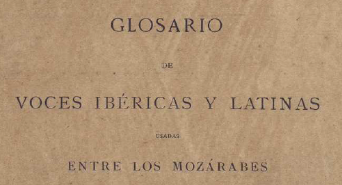

# Simonet-webapp

**Proyecto de informatización del *Glosario de voces ibéricas y latinas usadas entre los mozárabes* de Francisco Javier Simonet (en desarrollo).**

[Acceso al glosario](https://simonet2.azurewebsites.net/)

Todos los aspectos presentes del proyecto están hospedados en Azure (aplicación .NET Core MVC en App Service, imágenes de la páginas en Blob Storage,
base de datos en Azure SQL Database).

El método de extracción de las entradas, sus páginas correspondientes y (en el futuro) otra información perteneciente a cada entrada se encuentra en el
archivo Create_database.py del [repositorio hermano](https://github.com/ni-vera/Simonet-database). Dado lo imperfecto del método de extracción, se ha 
habilitado una función colaborativa mediante la cual los usuarios pueden proponer la adición de entradas no recogidas por el método de extracción re-
llenando un formulario.

## Características ya implementadas

-Consulta de las entradas de las primeras 18 páginas.

-Función colaborativa: propuestas de entrada.

-Panel de administrador para la creación manual de nuevas entradas y la apbrobación de las propuestas colaborativas.

## Características por implementar

-Búsqueda tanto simple (por nombre de entrada) como avanzada.

-Representación gráfica de resultados de búsqueda avanzada para posibilitar la detección de patrones.

-Función colaborativa avanzada (no limitada a propuestas de entrada, sino abarcando también la modificación de campos de entradas ya existentes).

-Aviso por correo a administrador cada vez que se haga una propuesta de entrada o edición.
